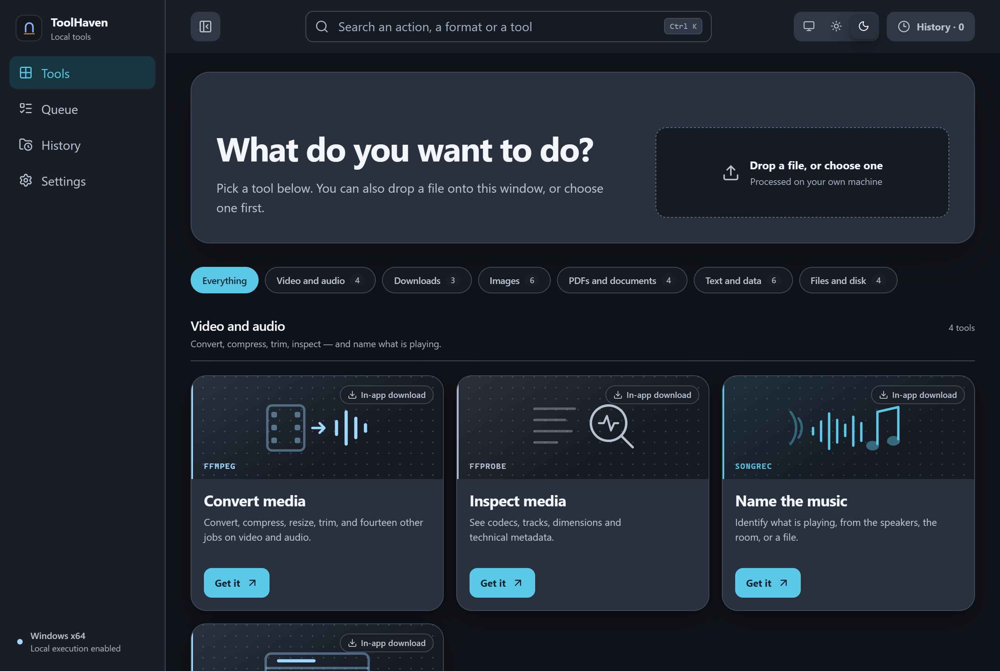
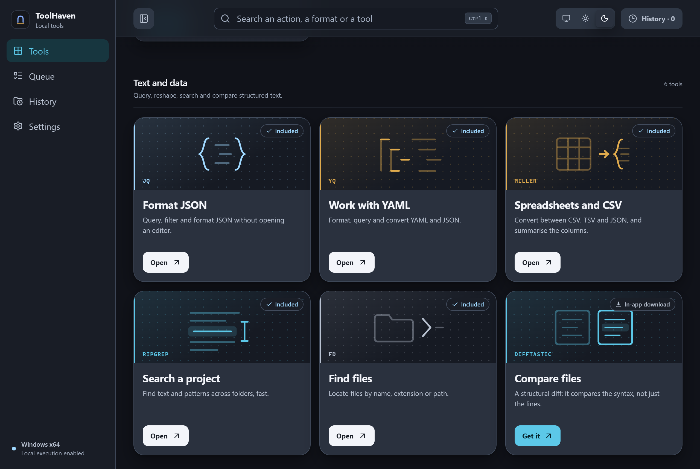
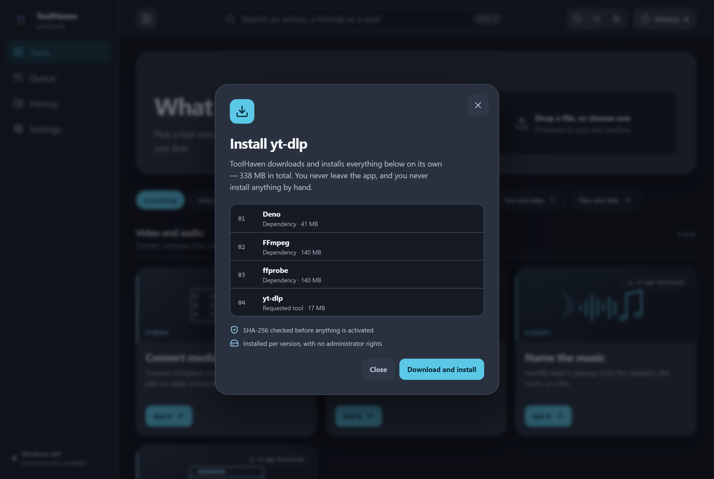
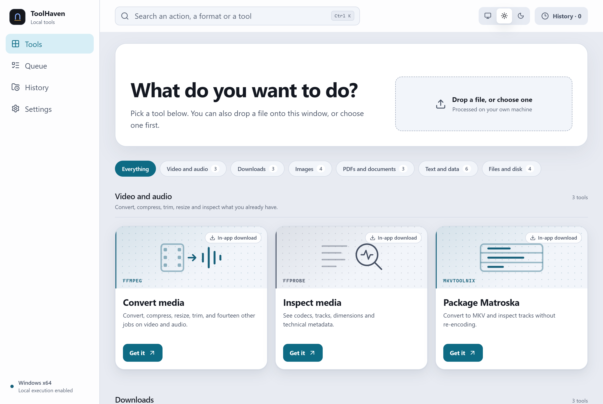

<div align="center">

# ToolHaven

**A Windows desktop bench for the open-source tools you already trust —
delivered so you never install a single one of them by hand.**

[](https://github.com/diegormirhan/toolhaven-desktop/tags)
[](LICENSE)
[](apps/desktop/src-tauri/)
[](apps/desktop/src-tauri/src/)
[](apps/desktop/src/)

[](#running-it)
[](#what-it-refuses-to-do)
[](#what-it-refuses-to-do)
[](#the-boundary-that-shapes-everything)
[](#how-the-tools-get-there)
[](#running-it)

[The problem](#the-problem-it-takes-seriously) ·
[Delivery](#how-the-tools-get-there) ·
[The boundary](#the-boundary-that-shapes-everything) ·
[Tools](#the-catalog) ·
[Jobs](#jobs-that-outlive-the-panel) ·
[Run it](#running-it) ·
[Limits](#known-limitations)

</div>

---

Converting a video, flattening a PDF, stripping EXIF off a photo, turning a CSV into JSON — every
one of those is a solved problem with an excellent open-source tool behind it. The cost is never the
work. It is finding the tool, installing it, putting it on PATH, and learning a different set of
flags for each one.

ToolHaven puts twenty-two of them behind one window, one visual grammar, and one queue. Nine ship
inside the 15.6 MB installer. Nine more the app downloads, verifies and installs on its own, in the
background, with a progress bar. **You never open a browser, never run a package manager, never
touch PATH.**

Everything runs on your machine. No account, no cloud, no telemetry, no AI.



*The catalog is the product. Every card carries the same four things: what you get, which project
does the work, how it arrives, and one action. The badge is the delivery channel — `Included`
shipped in the installer, `In-app download` the app fetches itself, `With dependencies` means it
drags three more along.*

---

## The problem it takes seriously

A desktop utility that wraps CLI tools has two failure modes, and most of them pick one.

**It bundles everything**, and the installer is a gigabyte. FFmpeg alone is 140 MB, Pandoc 40, Deno
93. Ship them all and every user downloads every tool they will never open, and every patch to any
one of them means downloading all of it again.

**Or it bundles nothing**, and the first thing a "just works" app tells you is to go install
something else. That is the failure ToolHaven started with: for most of its history it only
*detected* tools already on the machine, so on a clean Windows every card said `Not installed` and
nothing ran.

The answer is not a compromise between the two — it is that **the delivery channel belongs in the
manifest, per tool**, and the app implements both:

| | Ships how | Chosen because | Count |
|---|---|---|---|
| `bundled` | Inside the installer | Single executable, permissive licence, small | 9 |
| `downloadable` | The app fetches it, verified | Large, or copyleft, or both | 9 |
| `planned` | Not distributed yet | No pinnable versioned artifact exists | 4 |

Nothing copyleft went into the installer. That is the conservative position `docs/LICENSING.md`
argues for, and it costs nothing here: the GPL tools are the large ones anyway, so they were headed
for the download channel regardless.

---

## How the tools get there

### Nine arrive in the installer

`tooling/tools.json` pins an exact URL, version and **SHA-256** for every bundled tool. At build
time `scripts/tools/stage-embedded-tools.mjs` downloads each artifact, checks the digest, extracts
the executable and stages it where the Tauri bundler picks it up.

A hash mismatch **aborts the build**. That is the point: an artifact that does not match the pinned
digest is not the artifact anyone reviewed.

```
jq 1.8.2 · yq 4.53.6 · ripgrep 15.2.0 · fd 10.5.0 · Miller 6.21.0
tokei 12.1.2 · hexyl 0.17.0 · Dust 1.2.5 · Oxipng 10.2.1
```

47 MB of executables, all MIT / Apache-2.0 / BSD-2 / Unlicense, compressing to a **15.6 MB
installer**. `7z l` on the NSIS output shows `tools\*.exe` sitting beside `toolhaven.exe`.



*Two delivery channels, one visual grammar. The `Included` cards work the second the installer
finishes; the `Get it` cards open a plan first. The card never moves between rails when its state
changes — only its badge and its button do.*

### Nine more the app installs itself

Click `Get it` and the app resolves the dependency graph, then downloads, verifies and activates
every step. yt-dlp is the interesting case: it needs Deno for YouTube's JS challenges, and FFmpeg
plus ffprobe to merge what it downloads.



*Four downloads for one click, ordered so dependencies land first. The app is telling you what it is
about to do before it does it — and what it guarantees while doing it.*

The component store has four properties worth naming:

- **Keyed by digest, not by tool.** FFmpeg and ffprobe come from the same 140 MB archive, so they
  are downloaded once and share one directory.
- **Staged, then activated by rename.** The staging directory is a sibling of the target, so the
  activation is an atomic rename on the same volume. A failure mid-install can never leave a
  half-extracted component live.
- **No elevation, ever.** Components land under `%LOCALAPPDATA%`, never in Program Files.
- **Zip entries are validated.** `enclosed_name` rejects absolute paths and `..`, so a hostile
  archive cannot write outside the store.

### Resolution order

```
1 · <install dir>/tools/       the version we pinned, verified and tested
2 · the component store         what the app downloaded and verified
3 · PATH                        whatever this machine happens to have
```

The order matters more than it looks. Git for Windows ships an `pdftotext.exe` that belongs to
**Xpdf, not Poppler** — a different project with different licensing — and it usually wins on PATH.
So Poppler is probed through `pdftoppm.exe`, which Xpdf does not ship, and every Poppler command
resolves from that installation's own directory. There is a test for it.

Same class of trap: `convert.exe` on Windows is Microsoft's filesystem converter. ImageMagick is
only ever invoked as `magick.exe`. Also tested.

---

## The boundary that shapes everything

**The interface cannot run a command.** It sends a typed operation — `{ toolId, operationId, inputPaths, options }` —
and a Rust adapter turns validated values into a known executable plus an argument array. No string
is ever concatenated into a command line.

```rust
("ffmpeg", "extract-audio") => Ok(vec![
    "-n".into(), "-nostdin".into(),
    "-i".into(), input,
    "-map".into(), "0:a:0".into(), "-vn".into(),
    output,
]),
```

That single decision explains most of the rest of the design:

- **Every capability costs a contract.** Forty operations exist because forty argv shapes were
  written and tested, not because forty flags were exposed.
- **Options are validated as values, not as text.** An upscale factor must be a number greater
  than 1; a DPI must land between 1 and 2400; an oxipng level must be 0–6 or `max`. Those checks
  live in a pure function with no filesystem access, so they are testable on their own — which
  caught the first version of them passing for the wrong reason.
- **Originals are never overwritten.** An existing destination is refused before the process starts.
  ExifTool writes through `-o` into a new file, never `-overwrite_original`.
- **hyperfine was rejected over it.** Permissive licence, genuinely useful, and it benchmarks
  *arbitrary shell commands you supply*. Integrating it would mean shipping the exact thing this
  boundary exists to prevent.

---

## The catalog

Twenty-two tools, grouped by the result you want rather than by the project that provides it.

| | Tools | What you get |
|---|---|---|
| **Files, images, documents** | qpdf · Poppler · libvips · ImageMagick · Oxipng · ExifTool | merge and split PDFs, extract text, rasterise a page, resize, crop, convert, optimise PNG, read and strip metadata |
| **Media and downloads** | yt-dlp · FFmpeg · MKVToolNix · ffprobe | download video or audio, transcode, trim, remux to MKV, inspect codecs |
| **Dev tools and archives** | jq · yq · Miller · Difftastic · ripgrep · fd · tokei · hexyl · Dust · 7-Zip · Pandoc · Deno | JSON and YAML, CSV to JSON, structural diff, search, find, count code, hex preview, disk usage, archives, document conversion |

Each card's artwork is a drawing of what the tool produces — stacked pages, a crop frame, a
filmstrip resolving into a waveform — on one shared 200 × 100 grid, in the card's accent colour. A
rail of twelve reads as one set instead of twelve unrelated icons.



*Light and dark are the same tokens with different values; no rule below the token block names a
colour. The switch offers System as well, and the choice is remembered per machine.*

### What it refuses to do

Rejections are recorded with their reason in `docs/TOOL-MATRIX.md`, because a catalog is defined as
much by what stays out:

| | Why not |
|---|---|
| **Ghostscript** | AGPL-3.0, with Artifex enforcing it against distribution alongside non-AGPL software. It would enter only if ToolHaven itself became AGPL. |
| **Tesseract** | Apache-2.0, no licensing problem at all. Its engine is an LSTM neural net, and this product does not use AI. Rejected on product grounds, and it costs us OCR. |
| **pngquant** | GPL-3.0 with a commercial licence offered explicitly for non-GPL use — the legal ambiguity `LICENSING.md` says to avoid. |
| **hyperfine** | It runs arbitrary shell commands. See [the boundary](#the-boundary-that-shapes-everything). |

Also out, and not coming back: cloud sync, accounts, telemetry, generative AI, "enhance with AI"
upscaling, DRM removal.

---

## Jobs that outlive the panel

Start an operation, close the tool, and it keeps running. That sounds obvious and it is the thing
the app got wrong for longest: execution used to live inside the panel component, so closing the
panel took the progress, the result and the record with it.

Execution now belongs to an application-level queue. The host stamps a **job id** on every progress
event, so progress addresses one queue entry rather than a `tool + operation` pair — which matters
the moment two conversions of the same kind run at once.

Two bugs that only instrumentation would have found:

- **The progress bar never moved on downloads.** The host was parsing yt-dlp's *stderr*; yt-dlp
  writes `[download] … %` to *stdout*. Reading the wrong stream produced a bar frozen at 0% from
  start to finish.
- **Downloads re-encoded when they had no reason to.** `--recode-video mp4` re-encoded files that
  were already mp4. Format selection plus `--merge-output-format` now remuxes instead, which is both
  faster and lossless.

A job starts with **no percentage at all**, not 0%. Until a tool reports one, the bar is
indeterminate and the label just says `Running`. The app does not invent a number it does not have.

---

## Running it

Needs Windows x64. One command does everything — checks the toolchain, installs the dependencies,
downloads and verifies the nine pinned tools, runs every check, and builds the installer:

```powershell
.\setup.ps1
```

Every step checks whether its work is already done, so re-running it is safe and takes about a
minute and a half. It finishes by printing where the installer landed.

```
  3  Downloading and verifying the tools that ship in the installer
     9 executables staged, 47.5 MB
  4  Running the checks
     Everything green
  5  Building the Windows installer

  Done
     ToolHaven_0.1.0_x64-setup.exe  15.6 MB
     took 01:44
```

**Nothing is installed on your machine unless you ask.** Missing prerequisites are reported with the
exact command that fixes them; `-InstallPrerequisites` lets the script run those itself. Installing
a compiler toolchain is the machine owner's decision, not a build script's.

| Flag | Effect |
|---|---|
| `-InstallPrerequisites` | Install Node, Rust and the VS C++ build tools with winget if they are missing |
| `-Start` | Open the app when the build finishes |
| `-Dev` | Skip the release build and open the development window |
| `-SkipTests` | Skip the domain, interface and host suites |
| `-SkipBuild` | Set everything up without producing an installer |

Or drive the same steps by hand:

```powershell
npm install
npm run tools:stage  # download and verify the bundled artifacts
npm run tauri:build  # stages them again, then builds
npm run dev          # interface only, in a browser
npm run tauri:dev    # the real Windows app
npm run screenshots  # regenerate the images in this README
```

The build stages the bundled tools first, so the installer never leaves without them. The output is
in `apps/desktop/src-tauri/target/release/bundle/` — `.msi` and `.exe`.

The browser preview renders the whole interface but **refuses to execute anything** and says so — it
has no native bridge, and pretending otherwise would be the dishonesty this project keeps arguing
against.

---

## Verifying it

```bash
npm test                                                        # 22 domain + 53 interface
cargo test --manifest-path apps/desktop/src-tauri/Cargo.toml     # 19 host
npm run validate:tools && npm run audit:capabilities             # manifest and capability audit
```

The interesting suite is the one that talks to real binaries:

```bash
cargo test --manifest-path apps/desktop/src-tauri/Cargo.toml -- --include-ignored --nocapture
```

It generates its own fixtures — a PDF built byte by byte, a video from FFmpeg's `lavfi`, a CSV, a
local HTTP server to download from — and runs **every operation in the catalog** against the real
tool. It prints `PASS tool/operation` per line, and when a tool is not installed it **names what it
could not verify** rather than passing quietly:

```
PASS poppler/extract-text + rasterize
PASS mkvtoolnix/remux + inspect
Every catalog operation passed against a real binary.
```

A second opt-in test downloads a real component end to end — fetch, verify, extract, activate — and
asserts that installing it again is a no-op rather than a second download.

The screenshots in this file are generated by `scripts/screenshots.mjs`, which drives headless
Chrome over the DevTools protocol. A screenshot nobody can regenerate quietly starts lying after
the next change to the interface.

---

## Known limitations

Stated because they are real, not because they are theoretical:

- **Four tools still need to be there already.** 7-Zip, MKVToolNix, ImageMagick and ExifTool have no
  pinnable versioned artifact the app can fetch: two ship only as `.7z` or NSIS installers, and
  ExifTool's site keeps only the current release at a stable URL. Their cards say so instead of
  offering an install that would fail.
- **Nothing can be cancelled.** A running operation runs to completion. Killing a process tree on
  Windows properly needs Job Objects and a per-operation cleanup rule, and a Stop button that only
  sometimes works is worse than none.
- **The queue and the history are per session.** Closing the app loses both. Only metadata is worth
  persisting, and SQLite is not wired up yet.
- **The bundled tokei is from January 2021.** Upstream stopped publishing Windows binaries; the
  current tag has no artifacts at all. A five-year-old binary is bad, a permanently dead card is
  worse, and building from source in CI is the actual fix.
- **The interface is English only.** There is no i18n layer, so a second language is a rewrite of
  every string rather than a config change.
- **PDF text extraction only reads text.** A scanned page has no text to extract, and OCR is out
  by the no-AI rule above.
- **Only Windows x64.** ARM64 and the other platforms are not attempted, and the component store
  pins Windows artifacts exclusively.
- **Unsigned.** SmartScreen will warn on the installer until there is a certificate.

---

## Stack

`Tauri 2` · `Rust` (host, adapters, component store) · `React 19` · `TypeScript` · `Vite` ·
`ureq` + `zip` + `sha2` for the installer · no runtime dependencies beyond the tools themselves

Own code is MIT. Every third-party executable keeps its own licence, recorded with version, origin,
artifact URL and SHA-256 in `vendor/THIRD-PARTY-NOTICES.txt`, generated by the build.

Deeper reading: [`docs/ARCHITECTURE.md`](docs/ARCHITECTURE.md) ·
[`docs/TOOL-MATRIX.md`](docs/TOOL-MATRIX.md) · [`docs/LICENSING.md`](docs/LICENSING.md) ·
[`docs/SECURITY.md`](docs/SECURITY.md) · [`docs/decisions/`](docs/decisions/)
